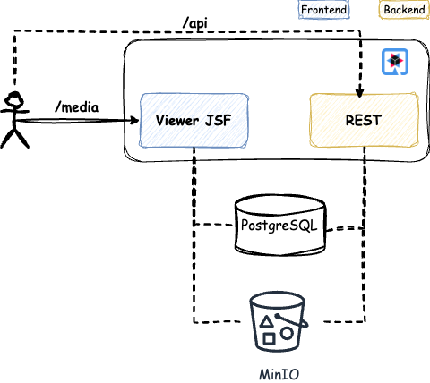
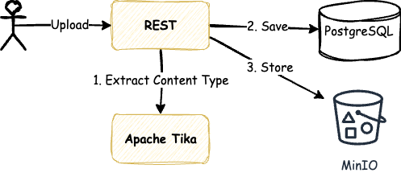
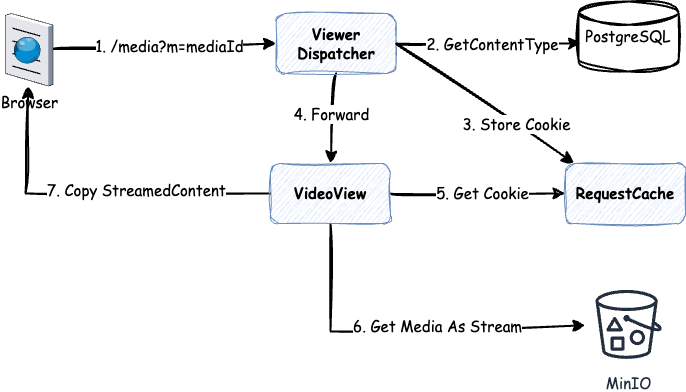

# Quarkus MinIO Media Storage

## Introduction
Recently, I faced a challenge related to media file availability. The system needed to support different media file types, such as video, audio, images, and documents, often in large sizes. The core challenge was enabling authenticated users to upload any number of media files, regardless of size, while ensuring the system correctly determines and validates their content type before storing them.

The media files had to be stored in S3 or a compatible storage solution, with flexibility to support both on-premises and public cloud environments. Additionally, non-authenticated users should be able to access the files for viewing, but downloading should not be permitted.

We live in the cloud era, where both microservices and data are hosted on the cloud. Therefore, deploying this application in the cloud was a natural choice.

## Why Quarkus?
My preferred cloud-native framework is [Quarkus](https://quarkus.io/), which provides seamless integration with various tools required for this challenge.

## High-Level Architecture
The application's high-level architecture is illustrated in the following diagram:



- **File Upload**: Users upload media files via a REST API.
- **Media Viewing**: Jakarta Server Faces (JSF) is used for media file viewing.
- **Metadata Storage**: File metadata (e.g., content type and URL) is stored in PostgreSQL (but any database can be used).
- **File Storage**: MinIO serves as the S3-compatible object storage solution.

[MinIO](https://min.io/) is a high-performance, S3-compatible object storage system designed for cloud-native applications, Kubernetes, and edge computing. It offers scalability, strong consistency, and enterprise-grade security while supporting distributed deployments. MinIO is optimized for large-scale data workloads, AI/ML, and analytics, making it a reliable solution for modern storage needs. Additionally, the MinIO Quarkus extension simplifies the integration of S3 support into the application.

## Backend Implementation
The backend consists of a REST API for file uploads. During the upload process, the system extracts the file's content type, which determines the appropriate media player type for rendering on the frontend.

For content extraction, I opted for [Apache Tika](https://tika.apache.org/), an open-source content analysis toolkit that detects, extracts, and processes metadata and text from various file formats, including PDFs, documents, images, and multimedia.

Finally, a URL is generated for each uploaded file and returned to the user upon successful upload.

> **Note**: The provided example focuses solely on media file processing and does not include security concerns such as virus scanning and authentication for simplicity.

A high-level diagram of the backend is shown below.



## Frontend Implementation
For the frontend, I chose [PrimeFaces](https://www.primefaces.org/), a popular open-source UI framework for JavaServer Faces (JSF). PrimeFaces offers a rich set of components, themes, and AJAX support for building modern, responsive web applications. It simplifies front-end development with built-in widgets, customizable UI elements, and seamless integration with Jakarta EE and Spring-based applications.

PrimeFaces provides built-in **Media, Video, Audio, and Document Viewer** components that use standard HTML5 elements or embedded libraries like PDF.js, eliminating the need for additional browser plugins.

A high-level diagram of the frontend is shown below.



## How It Works
In a previous article, I highlighted that **streaming** is the best approach for accessing large files, as it provides optimal throughput and low CPU usage with balanced memory consumption. This approach is also used in this implementation.

The generated file URL does not include media type information. When a user accesses the URL:

1. A Dispatcher servlet retrieves the content type from the database.
2. It generates a Cookie and forwards the request to the appropriate viewer page, which renders the correct media player type.

So far, so good. But how can media be accessed without allowing downloads or direct file access?

This is where **MinIO and PrimeFaces work together**:

- When accessing an object stored in MinIO (or any S3-compatible storage), it can be fetched as an **InputStream**.
- PrimeFaces generates a unique URL, and the stream is copied to the HTTP response using **StreamContent** support.
- Every time a media file is requested, the user sees a random URL in their Developer Console, but the browser URL remains unchanged.
- Additionally, disabling the browser's context menu helps prevent users from downloading or printing media files.

> **Note**: This solution does not fully prevent experienced users from downloading media. Feel free to enhance it based on your use case!

## Development and Testing
You may wonder how to integrate and test an S3-compatible object storage solution in your application. **MinIO makes this easy, and there is Testcontainers support for MinIO!**

I am a big fan of [Testcontainers](https://testcontainers.com/) because it simplifies development and provides better validation of implementations using real dependencies in tests.

## Implementation Limitations
- The default MinIO client is used for fetching objects (files) as a stream. For long videos, streaming may break. To mitigate this, consider customizing MinIO on both the client and server side.
- Videos and audio files are not seekable in this solution. If seek functionality is required, a dedicated media streaming server is recommended instead of a general-purpose object store.

## Installation
### Prerequisites
- JDK 21 or higher
- Maven 3.5+
- Docker (for running MinIO and PostgreSQL services)

### Steps
1. Clone the repository:
   ```sh
   git clone https://github.com/fejesa/quarkus-minio.git
    ```
2. Build the project:
   ```sh
   mvn clean install
   ```
3. Run the application in development mode:
   ```sh
    mvn quarkus:dev
    ```

## Configuration
The application can be configured via `application.properties`. The following properties are available:
```properties
# Quarkus HTTP configuration
quarkus.http.port = 8080

# PostgreSQL configuration
quarkus.datasource.devservices.port = 5432
quarkus.datasource.devservices.db-name = media
quarkus.datasource.devservices.username = media
quarkus.datasource.devservices.password = media

# Hibernate ORM configuration
quarkus.hibernate-orm.database.generation = drop-and-create
quarkus.hibernate-orm.log.sql = true

# MinIO configuration
quarkus.minio.devservices.port = 9000
quarkus.minio.devservices.image-name = minio/minio
quarkus.minio.devservices.access-key = minioaccess
quarkus.minio.devservices.secret-key = miniosecret
minio.bucket-name = media

# The maximum allowed size of an HTTP request body.
quarkus.http.limits.max-body-size = 501M
```

## Usage
Once the application is running, you can upload files from command line using for example [httpie](https://httpie.io/) or [curl](https://curl.se/).
The following example demonstrates how to upload the sample files from the project root directory using _httpie_:
   ```sh
   http --verify=no --form POST http://localhost:8080/api \
   media@./src/test/resources/sample-audio.mp3 \
   description='{"checksum":"9a2270d5964f64981fb1e91dd13e5941262817bdce873cf357c92adbef906b5d"}'
   
   http --verify=no --form POST http://localhost:8080/api \
   media@./src/test/resources/sample-image.png \
   description='{"checksum":"aad96d410d92b5589d41e8462507e3af57682022db3d3711a236c0245fcf296e"}'
   
   http --verify=no --form POST http://localhost:8080/api \
   media@./src/test/resources/sample-video.mp4 \
   description='{"checksum":"71944d7430c461f0cd6e7fd10cee7eb72786352a3678fc7bc0ae3d410f72aece"}'
   
   http --verify=no --form POST http://localhost:8080/api \
   media@./src/test/resources/sample-pdf.pdf \
   description='{"checksum":"38c9792d725c45dd431699e6a3b0f0f8e17c63c9ac7331387ee30dcc6e42a511"}'
   ```
where `media` is the form field name for the file and `description` is a JSON object containing checksum information.
To calculate the checksum of a file, you can use the following command:
   ```sh
   sha256sum sample-audio.mp3
   ```
The application will respond with url to access the uploaded file from browser.

### How to view media files
When you navigate to `https://localhost:8080/media?m=xxx`, you will see a sample media file of the specified type. You can check that:
* file cannot be downloaded
* file cannot be accessed directly by URL - open the DevConsole of the browser and try to access the file directly by copying the URL from the Network tab.
* right-click on the file or the page should not work
* try to open the URL from a different tool, for example, Postman, and check if the file is accessible.
* if the file type is PDF then printing the file should not work.
* in case of any error, the user should be redirected to the error page.

**Note**: The list of the uploaded files can be accessed at `http://localhost:8080/api`.

## Starting the Application Using Docker
### Build Docker file
To build the docker image, execute the following commands
```
mvn clean package -DskipTests
docker build -f src/main/docker/Dockerfile.jvm -t media-fs .
```
The application depends on MinIO and PostgreSQL services. You can start them using the following commands:
```sh
docker compose -f src/main/docker/services.yml up
```
where `services.yml` is a docker-compose file that starts MinIO, and PostgreSQL services and the application as a container.

* **PostgreSQL Database Service**: Runs a PostgreSQL database container.
  * Port: 5432
  * Data Persistence: ../../../postgres-data
  * Health Check: Ensures PostgreSQL is ready before other services depend on it.
* **MinIO Object Storage Service**: Runs a MinIO container for object storage.
  * Ports: 9000 (API), 9001 (Web UI)
  * Data Persistence: ../../../minio-data
  * Initialization: The minio-init service initializes MinIO, such as creating buckets.
* **Application Service (media-fs)**: Runs the main application container.
  * Port: 8080 (HTTP)
  * Port 10099 (JMX)

**Note**: The application will be available at `http://localhost:8080` and MinIO at `http://localhost:9000`. To access MinIO console, use the user **minioroot** with password **miniopassword**.

## Notes
The application uses [PrimeFaces](https://www.primefaces.org/) and [Primefaces Extensions](https://www.primefaces.org/showcase-ext/views/home.jsf) to display media files.
We use the following components:
* [Image](https://www.primefaces.org/showcase/ui/multimedia/graphicImage.xhtml)
* [Document Viewer](https://www.primefaces.org/showcase-ext/sections/documentviewer/basic.jsf)
* [Video](https://www.primefaces.org/showcase/ui/multimedia/video.xhtml)
* [Audio](https://www.primefaces.org/showcase/ui/multimedia/audio.xhtml)


## Contributing
Contributions are welcome! Please fork the repository and submit pull requests.
